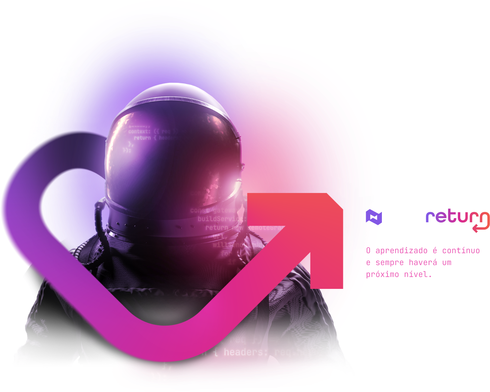
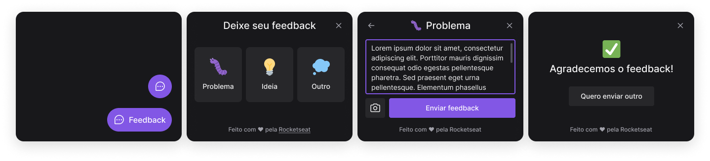
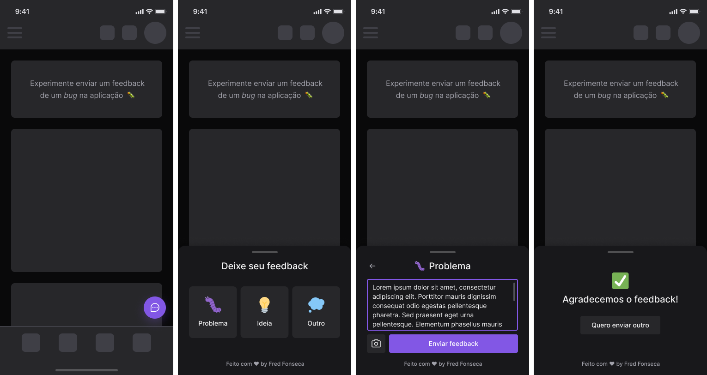

<h1 align="center">
    <br>
    
</h1>

<p align="center">
    
    <a aria-label="Completado" href="https://nextlevelweek.com">
        </img>
    </a>
    
</p>

<p align="center">
    <a href="#feedget-">Projeto</a>&nbsp;&nbsp;&nbsp;|&nbsp;&nbsp;&nbsp;
    <a href="#-tecnologias">Tecnologias</a>&nbsp;&nbsp;&nbsp;|&nbsp;&nbsp;&nbsp;
    <a href="#-layout">Layout</a>&nbsp;&nbsp;&nbsp;|&nbsp;&nbsp;&nbsp;
    <a href="#-instalação">Intalação</a>&nbsp;&nbsp;&nbsp;|&nbsp;&nbsp;&nbsp;
    <a href="#-license">Licença</a>
</p>

## Feedget 
Este projeto foi desenvolvido com o intuito de criar um componente de feedbaks reutilizável. Dentre as funções do feedget(feedback widget) estão: A coleta de feedbacks do usuário sobre problemas, ideias e outros. O feedget também permite o usuário tirar prints da tela, que são enviadas em formato de email para os administradores do app juntamente com o tipo de feedback e o comentário. Projeto realizado na Next Level Week #8

## 🚀 Tecnologias
Esse projeto foi desenvolvido com as seguintes tecnologias:

- React
- React Native
- TypeScript
- TailwindCSS
- Vite
- Node
- Prisma
- Nodemailer
- Expo
- Axios

## 💻 Layout

### Desktop layout


### Mobile layout


## 💾 Instalação

Siga os passos a baixo para executar o projeto!

```bash

# Clone o repositório

$ git clone https://github.com/freddcf/feedget.git

# Instale todas as dependências do projeto

# Acesse a pasta do projeto no terminal
$ cd feedget

# Acesse a pasta do sub-projeto no terminal:
$ cd web                         # Projeto ReactJS
$ cd server                      # Projeto NodeJS
$ cd mobile                      # Projeto React Native

# Instale todas as dependências do projeto com o gerenciador de pacotes de sua preferência
$ npm install   /   yarn add     # Serve para ReactJS, NodeJS e React Native

# Execute o sub-projeto:
# ---------- PARA WEB ---------- #
$ npm run dev   /   yarn dev     # Para rodar o projeto Web (Frontend)

# --------- PARA SERVER ---------- #
$ npm run dev   /   yarn dev     # Para rodar o projeto Servidor (Backend)

# --------- PARA MOBILE --------- #
$ npm run start   /   yarn start # Para o projeto Mobile (Frontend Mobile)

# O ReactJS roda na porta: 3001
# O NodeJS roda na porta: 3333
# O React Native roda na porta: 19000 (Configure seu IP para rodar localmente com o expo)

# Acesse http://localhost:$PORT *Ex: Cuidado para não ligar dois ou mais projetos na mesma porta, pois o servidor pode não iniciar.

```


## 📝 License

Esse projeto está sob a licença MIT. Veja o arquivo [LICENSE](LICENSE) para mais detalhes.

---
<h4 align="center">
    Feito com 💙 ✨ by <a href="https://github.com/freddcf" target="_blank">Fred Fonseca</a>
</h4>
